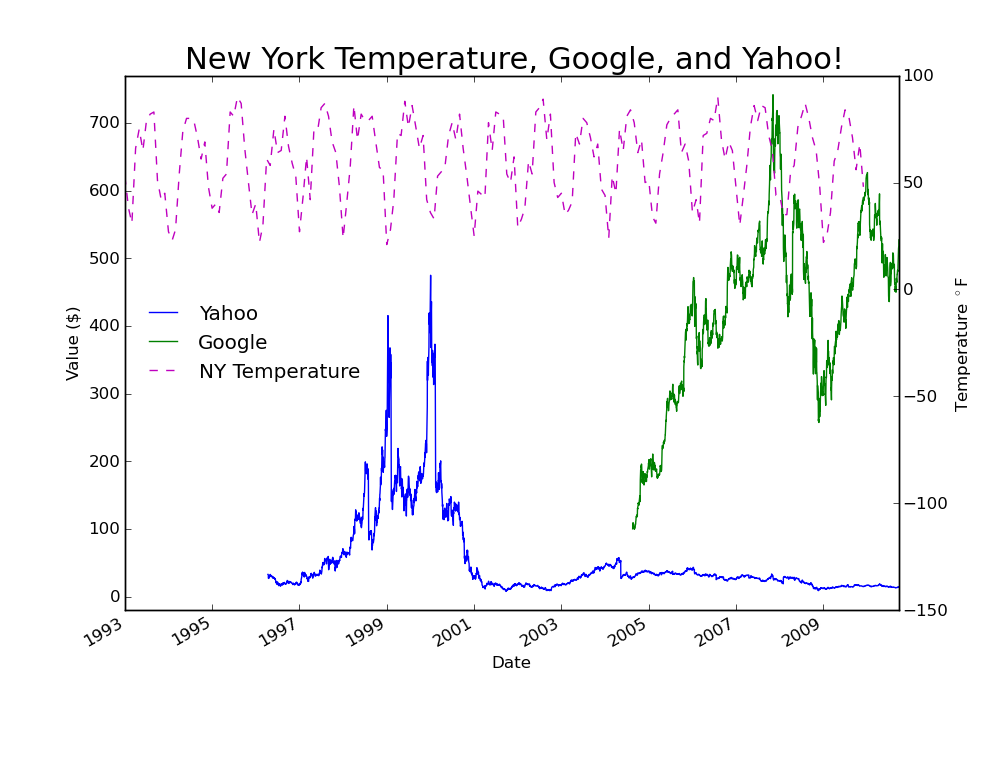
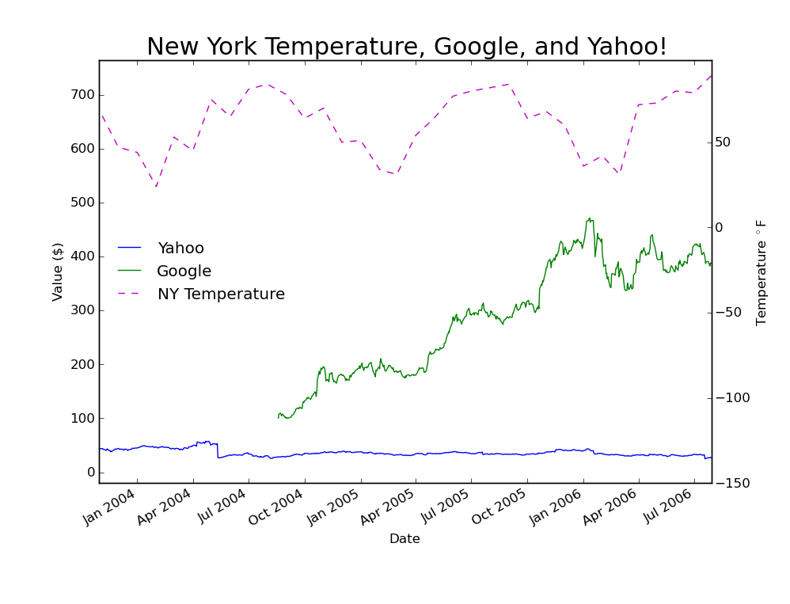

# Matplotlib Breakout

**Credit** This exercise is modified from an exercise assigned in the Spring
2012 session of AY 250 taught by Joshua Bloom et al.

## Goal

The goal of this breakout is to *exactly* replicate (minus differences due to 
screen aspect ratios) the following image with `matplotlib`:

When the user zooms in the image, the date on the x-axis should get more 
precise, like so:

The data for the exercise are contained in the `data` folder. 
Note that the dates
for the data are all stored in Modified Julian Date (MJD) format. You will need
to convert this to a numpy datetime object (**HINT**: you might want to search
GitHub for projects that convert from MJD-to-date rather than implement the
conversion yourself!).

Check out the [matplotlib gallery](http://matplotlib.org/gallery.html) for info
on how to achieve this goal.
